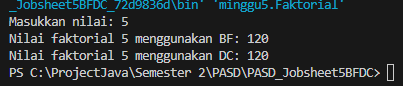
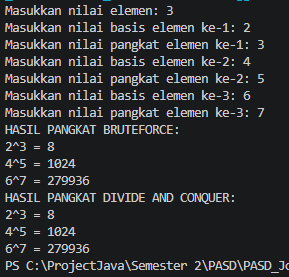
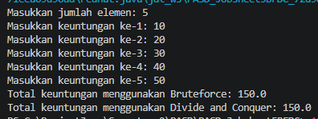

# PASD Jobsheet 5 BRUTE FORCE DAN DIVIDE CONQUER 
## 5.2.2.Verifikasi Hasil Percobaan


## 5.2.3.Pertanyaan
## 1.Pada base line Algoritma Divide Conquer untuk melakukan pencarian nilai faktorial, jelaskan perbedaan bagian kode pada penggunaan if dan else!
## a. Bagian if (n == 1)
Bagian ini disebut base case (kondisi dasar) pada rekursi.
Digunakan untuk menghentikan proses pemanggilan fungsi secara terus-menerus.
Secara matematis diketahui bahwa:
1!=1
Jadi ketika nilai n sudah mencapai 1, program langsung mengembalikan nilai 1 tanpa memanggil fungsi lagi.

## b. Bagian else
Bagian ini disebut recursive case.
Digunakan untuk membagi masalah menjadi masalah yang lebih kecil.
Program menghitung faktorial dengan rumus:
n!=n×(n−1)!
Fungsi akan memanggil dirinya sendiri dengan nilai yang lebih kecil (n-1) sampai mencapai kondisi base case.

## 2.Apakah memungkinkan perulangan pada method faktorialBF() diubah selain menggunakan for? Buktikan!
Ya, bisa.
Perulangan dapat diganti menggunakan while atau do-while. penjelasannya Perulangan while melakukan proses yang sama dengan for, yaitu: Mengalikan nilai fakto dengan i, Menambah nilai i, Mengulang sampai i <= n
## 3.Jelaskan perbedaan antara fakto *= i; dan int fakto = n * faktorialDC(n-1); !
## a. fakto = fakto * i;, 
Digunakan pada perulangan (iteratif / brute force): Nilai fakto terus diperbarui setiap iterasi.

## b.int fakto = n * faktorialDC(n-1);
Digunakan pada rekursi (Divide and Conquer): Nilai n dikalikan dengan hasil dari pemanggilan fungsi faktorial lagi dengan nilai lebih kecil (n-1).

## 5.3.2.Verifikasi Hasil Percobaan


## 5.3.3.Pertanyaan
## 1.Jelaskan mengenai perbedaan 2 method yang dibuat yaitu pangkatBF() dan pangkatDC()!
Perbedaan utama dari kedua method tersebut terletak pada cara perhitungan pangkatnya.
## a. pangkatBF() (Brute Force)
Method ini menghitung nilai pangkat dengan cara perkalian berulang secara langsung menggunakan perulangan (loop).
## b. pangkatDC() (Divide and Conquer)
Method ini menggunakan rekursi dengan pendekatan Divide and Conquer, yaitu:
Membagi masalah menjadi masalah yang lebih kecil, Menghitung bagian kecil tersebut, Menggabungkannya kembali
## 2.Apakah tahap combine sudah termasuk dalam kode tersebut?Tunjukkan!
Ya, tahap combine sudah ada dalam method pangkatDC().
Tahap combine terjadi ketika hasil dari dua pemanggilan rekursif digabungkan kembali. Contohnya pada kode:
```java
    return (pangkatDC(a, n/2) * pangkatDC(a, n/2)); dan
    return (pangkatDC(a, n/2) * pangkatDC(a, n/2) * a);
```
pangkatDC(a, n/2) adalah tahap divide
Perkalian hasil rekursi tersebut adalah tahap combine

## 3.Pada method pangkatBF()terdapat parameter untuk melewatkan nilai yang akan dipangkatkan dan pangkat berapa, padahal di sisi lain di class Pangkat telah ada atribut nilai dan pangkat, apakah menurut Anda method tersebut tetap relevan untuk memiliki parameter? Apakah bisa jika method tersebut dibuat dengan tanpa parameter? Jika bisa, seperti apa method pangkatBF() yang tanpa parameter?

Sebenarnya parameter pada method tersebut tidak terlalu diperlukan, karena di dalam class Pangkat sudah terdapat atribut: int nilai, pangkat; Artinya method bisa langsung menggunakan atribut dari object tanpa perlu menerima parameter lagi. Jadi method bisa dibuat tanpa parameter.
Contoh pangkatBF() tanpa parameter

```java
    int pangkatBF()
{
    int hasil = 1;
    for (int i = 0; i < pangkat; i++) {
        hasil = hasil * nilai;
    }
    return hasil;
}
```
## 4.Tarik tentang cara kerja method pangkatBF() dan pangkatDC()!
## Cara kerja pangkatBF()
Method menerima nilai basis (a) dan pangkat (n), 
Variabel hasil diinisialisasi dengan nilai 1, 
Program melakukan perulangan sebanyak n kali,
Setiap iterasi hasil dikalikan dengan a,
Setelah loop selesai, nilai hasil dikembalikan.
## Cara kerja pangkatDC()
Method menggunakan rekursi, 
Jika n == 1, maka langsung mengembalikan nilai a.
Jika n genap, maka:
```java
a^n = (a^(n/2)) × (a^(n/2)) 
```
jika n ganjil maka:
```java
a^n = (a^(n/2)) × (a^(n/2)) × a
```
## 5.4.2.Verifikasi Hasil Percobaan


## 5.4.3.Pertanyaan
## 1.Kenapa dibutuhkan variable mid pada method TotalDC()?
Variabel mid digunakan untuk membagi array menjadi dua bagian dalam metode Divide and Conquer. 
mid berfungsi untuk menentukan titik tengah array antara indeks l (left) dan r (right).
Dengan adanya mid, data dapat dibagi menjadi dua bagian yaitu:
Bagian kiri : dari l sampai mid, 
Bagian kanan : dari mid+1 sampai r. 
Pembagian ini diperlukan agar proses perhitungan dapat dilakukan secara rekursif pada bagian yang lebih kecil.
## 2.Untuk apakah statement di bawah ini dilakukan dalam TotalDC()?
```java
double lsum = totalDC(arr, l, mid);
double rsum = totalDC(arr, mid+1, r);
```
Statement tersebut digunakan untuk menghitung total nilai pada masing-masing bagian array setelah array dibagi menjadi dua bagian.
lsum menghitung jumlah elemen di bagian kiri array (l sampai mid)
rsum menghitung jumlah elemen di bagian kanan array (mid+1 sampai r)
Kedua statement tersebut merupakan proses rekursif yang terus membagi array sampai mencapai kondisi dasar.
## 3. Kenapa diperlukan penjumlahan hasil lsum dan rsum seperti di bawah ini?
```java
return lsum+rsum;
```
Penjumlahan ini dilakukan untuk menggabungkan hasil perhitungan dari dua bagian array yang telah diproses secara rekursif.
lsum adalah total dari bagian kiri, 
rsum adalah total dari bagian kanan.
Dengan menjumlahkan keduanya maka diperoleh total keseluruhan elemen array.
Tahap ini disebut sebagai tahap combine dalam algoritma Divide and Conquer.
## 4.Apakah base case dari totalDC()?
Base case pada method totalDC() adalah:
```java
if(l==r){
    return arr[l];
}
```
Kondisi ini terjadi ketika array hanya memiliki satu elemen.
Artinya:
Tidak perlu dibagi lagi,
nilai elemen tersebut langsung dikembalikan sebagai hasil.
## 5.Tarik Kesimpulan tentang cara kerja totalDC()
Method totalDC() bekerja menggunakan konsep Divide and Conquer dengan langkah-langkah berikut:

1. Method menerima array serta batas kiri (l) dan kanan (r).
2. Jika hanya ada satu elemen (l == r), maka elemen tersebut langsung dikembalikan.
3. Jika lebih dari satu elemen, array dibagi menjadi dua bagian menggunakan nilai mid.
4. Method memanggil dirinya sendiri secara rekursif untuk menghitung jumlah bagian kiri (lsum) dan bagian kanan (rsum).
5. Hasil kedua bagian tersebut dijumlahkan untuk mendapatkan total keseluruhan.

Perhitungan total dilakukan dengan membagi masalah menjadi bagian lebih kecil kemudian menggabungkan hasilnya.